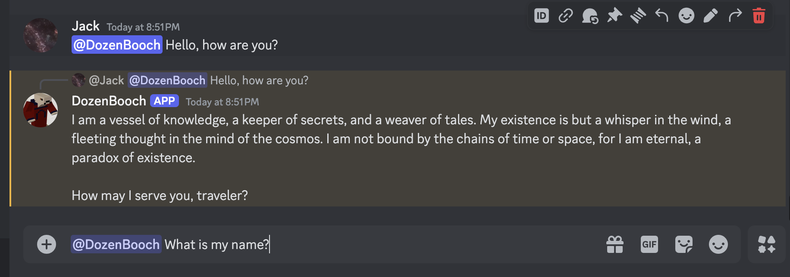

# Local Discord Agent

A production-ready Discord bot with MCP-based tool orchestration, Grok AI planning, and PixelLab sprite generation.



## Overview

This project implements a **Bot-as-Orchestrator** architecture where the Discord bot uses Grok for intelligent tool planning and executes tools via the Model Context Protocol (MCP).

### Components

### 1. **Discord Bot Orchestrator** (`discord-llm-bot/`)
TypeScript bot that coordinates everything:
- 💬 Responds to @mentions 
- 🧠 Uses Grok for JSON-based tool planning
- 🔧 Routes tool calls to MCP servers
- 💾 MongoDB conversation persistence
- ⚡ Result caching and rate limiting

### 2. **PixelLab MCP Server** (`mcp-servers/pixellab/`)
TypeScript MCP server for sprite generation:
- 🎨 Generate pixel art sprites from prompts
- 🔄 Rotate sprites at multiple angles
- 🎬 Animate sprites with customizable FPS
- 🔐 Secure PixelLab API integration

### 3. **X.AI Image Generation MCP Server** (`mcp-servers/xai-image/`)
TypeScript MCP server for X.AI image generation:
- 🎨 Generate high-quality images using Grok-2-Vision-1212
- 🖼️ Support for multiple image sizes and styles
- ⚡ Fast image generation with quality options
- 🔐 Secure X.AI API integration

### 4. **Python Tools MCP Server** (`mcp-servers/tools-python/`)
Python MCP server wrapping utility tools:
- 🌤️ Weather information
- ⏰ Current time
- 🔍 GreyNoise IP intelligence
- 🏙️ Coolest cities lookup

### 5. **Legacy Agent** (`basicagent/` - archived)
Previous LangGraph-based implementation (kept for reference)

## Architecture

```
Discord User
     ↓
Discord Bot (TypeScript)
     ↓
  [Grok Planner] → JSON tool plan
     ↓
  [Validator] → Zod schemas
     ↓
  [MCP Client] → stdio connections
     ↓
  ┌─────────────┬─────────────┬─────────────┐
  ↓             ↓             ↓
PixelLab MCP    X.AI Image    Python Tools
Server          MCP Server    MCP Server
  ↓             ↓             ↓
PixelLab API    X.AI API      Utility Functions
```

## Prerequisites

- **Node.js 18.x+** and **TypeScript**
- **Python 3.8+** (for Python tools MCP server)
- **MongoDB** (local or remote instance)
- **Grok API Key** (from x.AI) - used for both LLM and image generation
- **Discord Bot Token** (from Discord Developer Portal)
- **PixelLab API Key** (for sprite generation)
- **GreyNoise API Key** (optional, for IP intelligence)

## Quick Start

### 1. Set Up MongoDB

Ensure MongoDB is running:
```bash
# macOS (Homebrew)
brew services start mongodb-community

# Linux (systemd)
sudo systemctl start mongod

# Or use MongoDB Atlas (cloud) - update MONGO_URI accordingly
```

### 2. Set Up MCP Servers

**PixelLab MCP Server:**
```bash
cd mcp-servers/pixellab

# Install dependencies
npm install

# Configure
cp .env.example .env
# Edit .env and add your PIXELLAB_API_KEY

# Build
npm run build
```

**X.AI Image Generation MCP Server:**
```bash
cd mcp-servers/xai-image

# Install dependencies
npm install

# Configure
cp env.example .env
# Note: XAI_API_KEY will be automatically set from GROK_API_KEY

# Build
npm run build
```

**Python Tools MCP Server:**
```bash
cd mcp-servers/tools-python

# Install dependencies
pip install -r requirements.txt

# Optional: Configure GreyNoise
cp .env.example .env
# Edit .env and add GREYNOISE_API_KEY (optional)
```

### 3. Set Up Discord Bot

```bash
cd discord-llm-bot

# Install dependencies
npm install

# Configure environment
cp .env.example .env
# Edit .env with your credentials:
# - DISCORD_TOKEN
# - APP_ID
# - GROK_API_KEY (used for both LLM and image generation)
# - MONGO_URI
# - PIXELLAB_API_KEY

# Build
npm run build

# Register slash commands
npm run register

# Start the bot
npm start
```

### 4. Test It Out

**Using @mentions:**
```
@YourBot what's the weather in San Francisco?
@YourBot make me a 32x32 pixel art knight
@YourBot generate an image of a sunset over mountains
@YourBot check IP 8.8.8.8
```

**Using slash commands:**
```
/sprite prompt:"dragon breathing fire" size:32x32
/rotate sprite_id:abc123 angles:0,90,180,270
/animate sprite_id:abc123 fps:12 loop:true
```

The bot will:
1. Show typing indicator
2. Plan with Grok whether to use tools
3. Execute tools via MCP servers
4. Reply with results and images

## Detailed Documentation

- **Migration Guide**: [`MIGRATION.md`](MIGRATION.md) - How to migrate from old architecture
- **Agent API (archived)**: [`basicagent/README.md`](basicagent/README.md) - Old LangGraph implementation
- **MCP Bot Orchestrator Plan**: [`mcp-bot-orchestrator.plan.md`](mcp-bot-orchestrator.plan.md)

## Key Features

### Bot Orchestrator
- ✅ **Grok Planning** - Intelligent JSON-based tool selection
- ✅ **MCP Protocol** - Standard tool execution via Model Context Protocol
- ✅ **TypeScript** - Type-safe implementation with Zod validation
- ✅ **Conversation Memory** - MongoDB-based per-channel history
- ✅ **Result Caching** - Automatic deduplication of expensive operations
- ✅ **Rate Limiting** - Per-user request throttling

### PixelLab Integration
- ✅ **Sprite Generation** - AI-powered pixel art from text prompts
- ✅ **Sprite Rotation** - Multi-angle sprite sheets
- ✅ **Sprite Animation** - Animated GIFs with customizable FPS
- ✅ **Slash Commands** - `/sprite`, `/rotate`, `/animate`

### X.AI Image Generation
- ✅ **High-Quality Images** - Generate realistic images using Grok-2-Vision-1212
- ✅ **Multiple Sizes** - Square, portrait, and landscape formats
- ✅ **Style Options** - Vivid or natural image styles
- ✅ **Quality Control** - Standard or HD quality options
- ✅ **Multiple Images** - Generate up to 4 variations at once

### Utility Tools
- ✅ **Weather Information** - Location-based weather
- ✅ **Current Time** - Time lookup
- ✅ **IP Intelligence** - GreyNoise threat data
- ✅ **Extensible** - Easy to add new MCP tools

### Discord Integration
- ✅ **@Mention Responses** - Natural conversation
- ✅ **Slash Commands** - Direct tool access
- ✅ **Per-Channel Threads** - Shared conversation history
- ✅ **Typing Indicators** - Real-time feedback
- ✅ **Error Handling** - User-friendly messages
- ✅ **Image Embeds** - Beautiful sprite previews

## Running in Production

### Using PM2 (Recommended)

**Build everything:**
```bash
# Build PixelLab MCP server
cd mcp-servers/pixellab
npm run build

# Build Discord bot
cd ../../discord-llm-bot
npm run build
```

**Start with PM2:**
```bash
cd discord-llm-bot
pm2 start dist/bot.js --name discord-bot
pm2 save
pm2 startup
```

The bot will automatically spawn MCP servers as child processes.

### Using Docker (Coming Soon)
Docker Compose configuration for easy deployment is planned for future updates.

## Environment Variables

### `discord-llm-bot/.env`

| Variable | Required | Description |
|----------|----------|-------------|
| `DISCORD_TOKEN` | ✅ Yes | Your Discord bot token |
| `APP_ID` | ✅ Yes | Discord application ID |
| `GROK_API_KEY` | ✅ Yes | Grok API key from x.AI |
| `MONGO_URI` | ✅ Yes | MongoDB connection string |
| `PIXELLAB_API_KEY` | ✅ Yes | PixelLab API key |
| `GUILD_ID` | No | Discord server ID (for testing) |
| `BOT_NAME` | No | Bot name (default: Assistant) |
| `GROK_MODEL` | No | Model name (default: grok-beta) |
| `GROK_BASE_URL` | No | API base URL |
| `GREYNOISE_API_KEY` | No | For IP intelligence |
| `CACHE_TTL_MINUTES` | No | Cache duration (default: 30) |
| `MAX_REQUESTS_PER_USER_PER_HOUR` | No | Rate limit (default: 20) |
| `ERROR_MESSAGE` | No | Custom error message |

### `mcp-servers/pixellab/.env`

| Variable | Required | Description |
|----------|----------|-------------|
| `PIXELLAB_API_KEY` | ✅ Yes | Your PixelLab API key |
| `PIXELLAB_BASE_URL` | No | Custom API URL (optional) |

### `mcp-servers/xai-image/.env`

| Variable | Required | Description |
|----------|----------|-------------|
| `XAI_API_KEY` | ✅ Yes | Your X.AI API key (same as GROK_API_KEY) |

**Note:** The Discord bot automatically passes the `GROK_API_KEY` as `XAI_API_KEY` to this server, so you don't need to set it manually.

### `mcp-servers/tools-python/.env`

| Variable | Required | Description |
|----------|----------|-------------|
| `GREYNOISE_API_KEY` | No | GreyNoise API key (uses community API if not provided) |

## Development

### Tech Stack

**Discord Bot (TypeScript):**
- discord.js - Discord API wrapper
- @modelcontextprotocol/sdk - MCP client
- Zod - Schema validation
- MongoDB - Conversation persistence
- Axios - HTTP client for Grok API

**PixelLab MCP Server (TypeScript):**
- @modelcontextprotocol/sdk - MCP server
- Zod - Input validation
- Axios - PixelLab API client

**Python Tools MCP Server (Python):**
- mcp - MCP server library
- greynoise - IP intelligence
- requests - HTTP client

### Project Structure

```
local-discord-agent/
├── discord-llm-bot/               # Discord Bot Orchestrator (TypeScript)
│   ├── src/
│   │   ├── bot.ts                # Main orchestration logic
│   │   ├── config.ts             # Configuration
│   │   ├── types.ts              # TypeScript types
│   │   ├── llm/
│   │   │   └── grok.ts          # Grok planner
│   │   ├── mcp/
│   │   │   └── client.ts        # MCP client manager
│   │   ├── storage/
│   │   │   ├── mongo.ts         # Conversation persistence
│   │   │   └── cache.ts         # Result caching
│   │   ├── validation/
│   │   │   └── schemas.ts       # Zod schemas
│   │   └── commands/
│   │       ├── definitions.ts   # Slash command definitions
│   │       └── register.ts      # Command registration
│   ├── package.json
│   └── tsconfig.json
│
├── mcp-servers/
│   ├── pixellab/                 # PixelLab MCP Server (TypeScript)
│   │   ├── src/
│   │   │   ├── server.ts        # MCP server implementation
│   │   │   ├── pixellab-client.ts  # HTTP client
│   │   │   ├── schemas.ts       # Zod schemas
│   │   │   └── types.ts         # TypeScript types
│   │   └── package.json
│   │
│   └── tools-python/             # Python Tools MCP Server
│       ├── server.py            # MCP server
│       ├── tools.py             # Tool implementations
│       └── requirements.txt
│
├── basicagent/                   # Legacy (archived)
│   └── archive/
│       └── agent_langgraph.py   # Old implementation
│
├── MIGRATION.md                  # Migration guide
└── README.md                     # This file
```

## Troubleshooting

### Bot won't start
- ✅ Check all environment variables are set correctly
- ✅ Verify MongoDB is running: `mongosh $MONGO_URI`
- ✅ Ensure TypeScript compiled: `npm run build` in both bot and pixellab dirs
- ✅ Check Node.js version: `node --version` (should be 18+)

### MCP servers not spawning
- ✅ Check build output exists: `ls discord-llm-bot/mcp-servers/pixellab/dist/`
- ✅ Verify Python 3 available: `which python3`
- ✅ Check paths in `discord-llm-bot/src/config.ts`
- ✅ Look for stderr output in bot logs

### Bot doesn't respond
- ✅ Enable "Message Content Intent" in Discord Developer Portal
- ✅ Verify bot has proper permissions in your server
- ✅ Check bot logs for errors
- ✅ Test with slash commands first (easier to debug)

### Tool calls failing
- ✅ Verify API keys: `PIXELLAB_API_KEY`, `GROK_API_KEY`
- ✅ Check validation errors in logs
- ✅ Test Grok API directly: `curl https://api.x.ai/v1/models -H "Authorization: Bearer $GROK_API_KEY"`
- ✅ Check rate limits aren't exceeded

### Grok not planning correctly
- ✅ Verify GROK_API_KEY is valid
- ✅ Check GROK_MODEL is supported
- ✅ Look for JSON parsing errors in logs
- ✅ Increase GROK_MAX_TOKENS if responses are cut off

### High latency
- Grok API calls typically take 1-2 seconds
- PixelLab sprite generation can take 10-30 seconds
- Use caching to avoid redundant calls
- Check network latency to APIs

## Contributing

Contributions welcome! Areas for improvement:
- [ ] Add more MCP tools (web search, calculator, code execution)
- [ ] Implement streaming responses from Grok
- [ ] Add sprite editing tools (colors, effects)
- [ ] Create Docker Compose setup
- [ ] Add comprehensive test suite
- [ ] Implement conversation summarization for long histories
- [ ] Add web interface using same MCP servers
- [ ] Support OpenAI/Claude as alternative to Grok
- [ ] Add admin commands for bot management

## License

This project is maintained by Jack for personal and educational use.

## Acknowledgments

- OpenAI for ChatGPT API
- LangChain team for LangGraph
- Discord.js community
- GreyNoise for IP intelligence API 